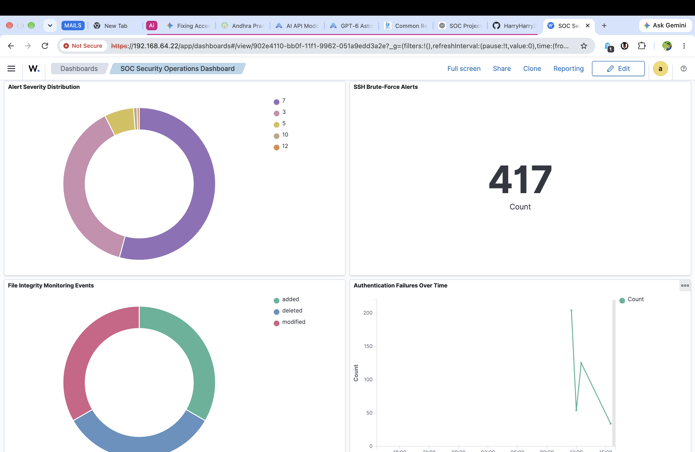
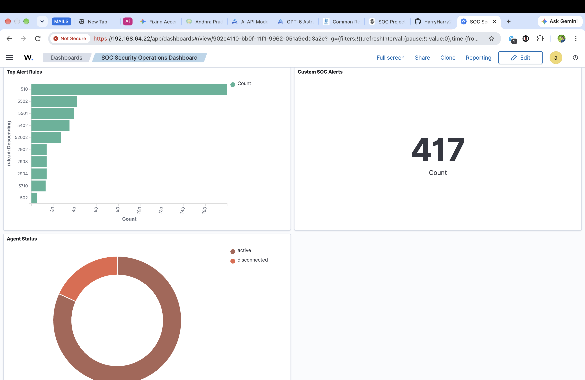

# Wazuh SOC Threat Detection & Response Lab

A hands-on Security Operations Center (SOC) lab built using Wazuh, Ubuntu Linux, UTM, SSH, File Integrity Monitoring (FIM), custom detection rules, MITRE ATT&CK mapping, and automated Active Response.

## Overview

This project demonstrates an end-to-end SOC monitoring and incident response workflow in an isolated virtual lab environment.

The lab was designed to practice:

- Security event monitoring
- Authentication failure detection
- SSH brute-force detection
- Custom Wazuh detection rules
- MITRE ATT&CK mapping
- File Integrity Monitoring (FIM)
- Automated Active Response
- Security alert investigation
- SOC dashboard visualization
- Incident documentation

## Lab Architecture

The environment consists of two Ubuntu virtual machines running on an Apple Silicon Mac using UTM.

```text
                         macOS Host
                             |
                            UTM
                             |
                    Shared Virtual Network
                             |
                +------------+------------+
                |                         |
                v                         v
         Wazuh Server              Ubuntu Endpoint
         SIEM / Manager             Wazuh Agent
                |                         |
                +-----------+-------------+
                            |
                     Security Events
                            |
                            v
                     Wazuh Dashboard
## Screenshots

### Wazuh SOC Dashboard



### Wazuh Security Alerts


